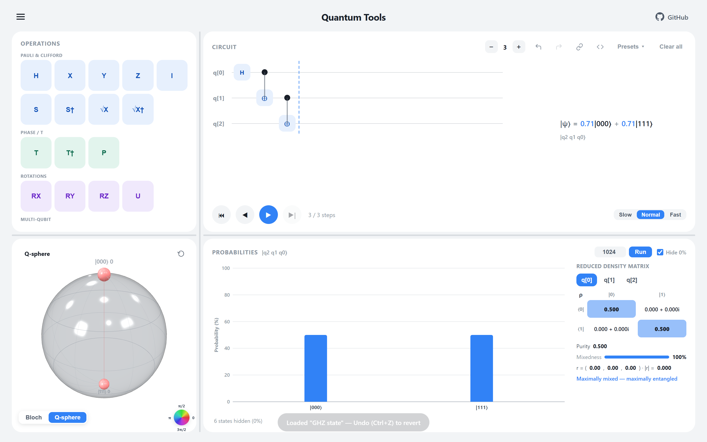
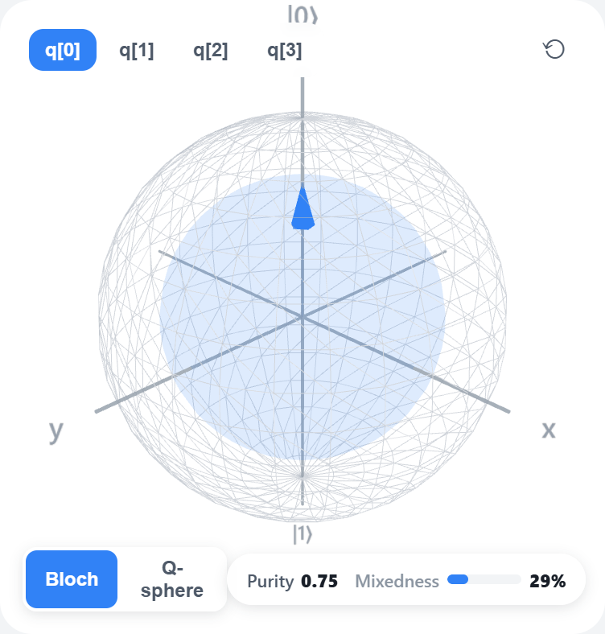
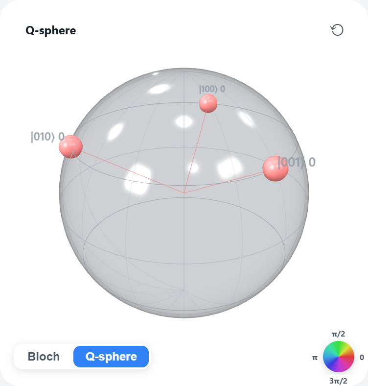
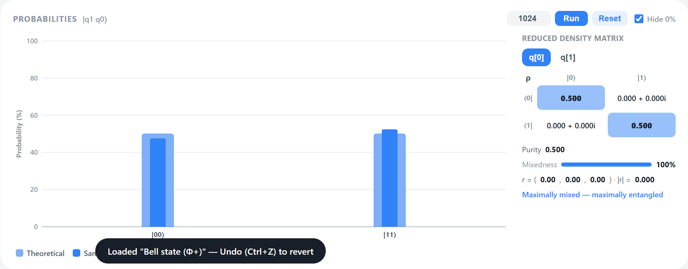
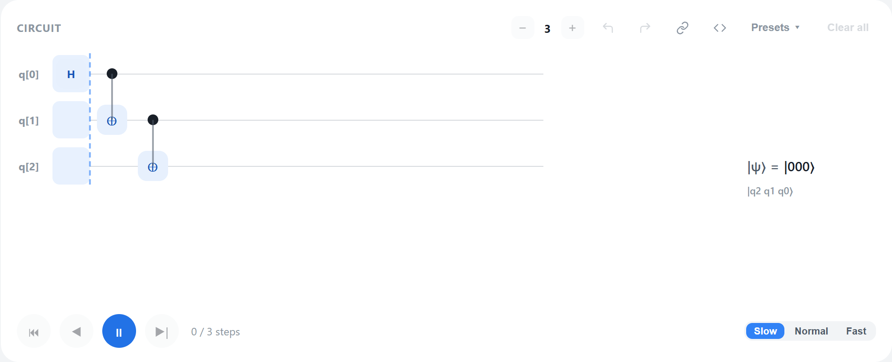

# Quantum Tools 🧪⚛️

> An interactive quantum-circuit simulator & visualizer that runs entirely in your browser.
> Built while teaching myself quantum computing during military service. 🇰🇷

[**▶ Live Demo**](https://seolwon64.github.io/quantumtools/) ·
 ·
 ·




Drag gates onto a circuit, watch the statevector evolve on a **Bloch sphere** and an **IBM-style Q-sphere**, sample real measurements, step through the circuit with smooth animation, and export straight to **Qiskit** — no install, no build step, no backend. Just open it and play.

It's a personal project, so it started as "let me really *see* what a Bell state looks like" and kind of snowballed from there. 😅

---

## ✨ Features

- **A Bloch sphere that's actually correct for entangled qubits.** Most teaching tools cheat and always pin the arrow to the surface. Here the arrow comes from the selected qubit's **reduced density matrix** — so when it entangles, the arrow *shrinks toward the center* (with a translucent inner sphere of radius `|r|`), and a fully mixed qubit shows a dot + a "Maximally mixed" caption. Live **Purity** and **Mixedness** readouts included.
- **IBM-style Q-sphere.** All 2ⁿ basis states on a glass sphere — latitude = Hamming weight, marker size = probability, color = phase.
- **Measurement sampling.** Run *N* shots and see the sampled counts overlaid on the theoretical probabilities (with a legend), CDF-sampled from `|amplitude|²`.
- **Smooth step-by-step playback.** A playback cursor sweeps the circuit column by column, probability bars tween with ease-in-out, the Q-sphere cross-fades — with Slow / Normal / Fast speeds. Respects `prefers-reduced-motion`.
- **Reduced density-matrix panel.** The 2×2 ρ for any qubit, shown as complex numbers with cells shaded so the diagonal / off-diagonal structure pops out.
- **One-click example circuits.** Bell, GHZ, W, phase kickback, Deutsch–Jozsa (balanced & constant), Bernstein–Vazirani, Grover, QFT, teleportation, superdense coding — grouped by Basics / Algorithms / Protocols, and **every one is verified against its expected statevector by a unit test** (a wrong example teaches the wrong idea).
- **Export & share.** Copy the circuit as **OpenQASM 2.0** or **Qiskit (Python)**, or share a link — the whole circuit is encoded right in the URL.
- **30+ gates & flexible controls.** Pauli/Clifford, phase/T, rotations, U, interaction gates (RXX/RYY/RZZ), SWAP/CSWAP, Measure/Reset/Barrier, and the relative-phase Toffolis (RCCX/RC3X). Drop a `•` control onto *any* gate to build CX, CZ, CCX, CSWAP, MCX… Up to 6 qubits.
- **Quality-of-life:** Undo/Redo (`Ctrl+Z` / `Ctrl+Shift+Z`), "Hide 0%" states, a colorblind-safe chart palette, resizable panels, and a clean light UI.
- **Solid engineering.** A pure, framework-free simulation core with **80+ unit tests** (exact amplitude checks, entanglement/purity, even QFT verified down to its DFT phases). Zero build tooling.

---

## 📸 Screenshots

<table>
<tr>
<td width="50%"><br><sub><b>Reduced-density Bloch sphere</b> — the arrow shrinks inside the sphere as the qubit becomes mixed.</sub></td>
<td width="50%"><br><sub><b>Q-sphere</b> — a W state's three basis nodes by weight, size, and phase.</sub></td>
</tr>
<tr>
<td width="50%"><br><sub><b>Measurement sampling</b> — sampled counts overlaid on theory, with the reduced density matrix alongside.</sub></td>
<td width="50%"><br><sub><b>Step playback</b> — the cursor sweeps the current column, which is highlighted as its gates apply.</sub></td>
</tr>
</table>

---

## 🚀 Try it

- **Online (easiest):** just open the [**live demo**](https://seolwon64.github.io/quantumtools/).


## 🧪 Tests

The simulation core is pure (no DOM), so it's unit-tested with Node's built-in runner:

```bash
node --test test/*.test.mjs
```

## 🛠 Tech & architecture

- **Vanilla JavaScript, ES modules** — no framework, no bundler, no build.
- **Three.js** (via CDN import map) for the 3D Bloch sphere / Q-sphere.
- **SVG** for the axed probability chart.
- A cleanly separated core:
  - `quantum.js` — gate matrices & statevector simulation
  - `circuit.js` — the circuit grid model, playback, undo/redo history
  - `density.js` — reduced density matrix, purity, Bloch vector (shared by the sphere & the ρ panel)
  - `chart.js` / `export.js` / `presets.js` — chart label logic, QASM/Qiskit/URL export, preset circuits
  - `scene.js` — the Three.js scenes; `main.js` — UI wiring

## 🗺 Roadmap

The header already says *"More tools coming soon"* — some ideas on the list:

- **Mid-circuit measurement** (real collapse + classical feedforward) — would unlock measurement-based teleportation and more
- **Measurement-basis selection** → a proper **CHSH / Bell-inequality** example (needs basis choice + correlation readout)
- More example circuits that need the above: **Shor period-finding** (needs more qubits), delayed-choice quantum eraser, magic-state distillation
- Noise / mixed-state playground
- Circuit import (paste QASM back in)

---

## 📖 About — my learning journey

I'm a physics student teaching myself quantum computing **independently during my military service in South Korea (2025–2027)**. This app grew out of that self-study — it's basically the "I want to *see* it" companion to the math I was working through. (Computer access is weekends only, so… slow and steady. Keep hustlin'!)

**Learning resources**
- IBM Qiskit learning courses, textbook & docs
- Griffiths, *Introduction to Quantum Mechanics* (daily study)

**Study log (highlights)**
- **2026-05:** Bell states + first visualizations; Qiskit environment
- **2026-06:** Statevectors & operators, multi-qubit systems, partial measurement, teleportation, the CHSH game
- **2026-07:** Running on real IBM hardware, Hamiltonian simulation, and building this — a quantum coin / statevector visualizer on the Bloch sphere 

*Concepts along the way:* wave–particle duality, wavefunctions & normalization, the Schrödinger equation (time-independent & dependent), the quantum harmonic oscillator.

---

## 📄 License

[MIT](LICENSE) © 2026 Seolwon64
